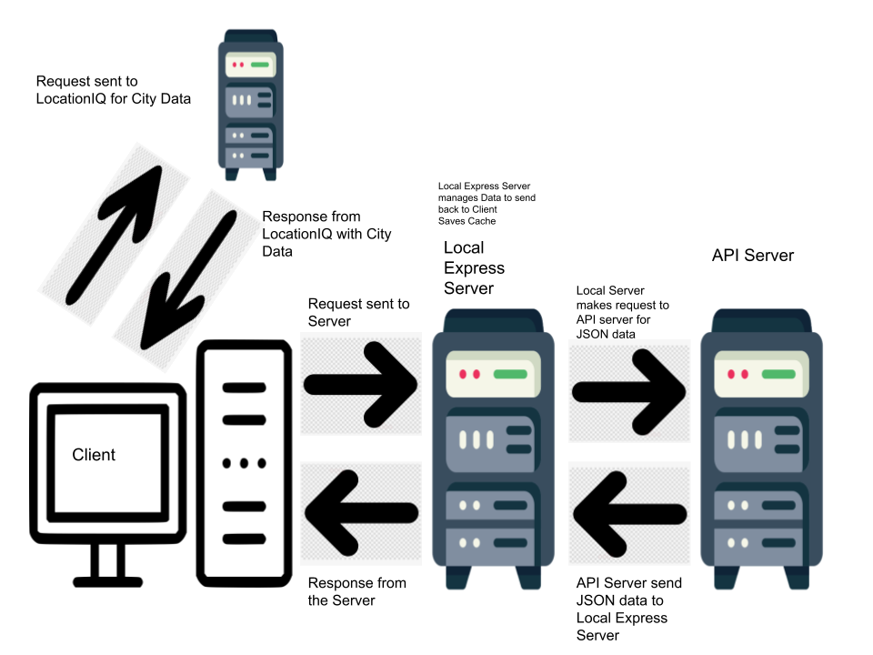

# City Explorer API

**Author**: Emmanuel Gonzales
**Version**: 1.0.0 (increment the patch/fix version number if you make more commits past your first submission)

## Overview

Creating a backend API that stores and sorts imformation to give to a front end

## Getting Started

A user would need to install nodemon, cors, express into there terminal and choose there own local host to past into the PORT

## Architecture

Nodemon, cors and express, along with website the hold the data from the API.

## Change Log

Name of feature: Creating Repo

Estimate of time needed to complete: 40 mins

Start time: 4:30

Finish time: 5:34

Actual time needed to complete: 1hr

## Credit and Collaborations

Acc Partners: Logan Reese Chris.

